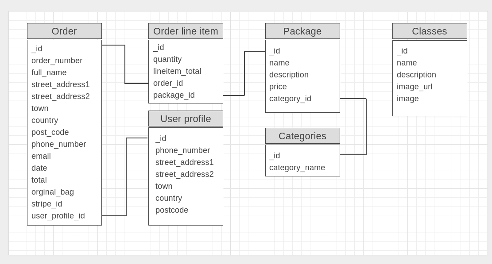

# Fitness Studio

## Full Stack Frameworks with Django

Fitness Studio is a simple website that can help customers to buy a package or packages of choice.
Customers can use contact section to make enquiry or book a class after purchase.

This project is for educational purposes only.

## [View live website](https://fitnesssstudio.herokuapp.com/)
___
# Table of contents

- [UX](#ux)
    - [Strategy](#strategy)
    - [Scope](#scope)
        - [User stories](#user-stories)
    - [Structure of the website](#structure-of-the-website)
    - [Skeleton](#skeleton)
    - [Surface](#surface)
- [Features](#features)
- [Technologies used](#technologies-used)
- [Testing](#testing)
- [Deployment](#deployment)
- [Credits](#credits)

___
# UX

## Strategy

The purpose of this project is to build a simple website that customers to buy a package or packages of choice.
This website can be easily changed for different type of businesses.
This template can be used as charity website, car mechanic, florist, or any other business without multiple choices and options.

## Scope

A MVP (minimum viable product) includes:

- landing page with and timetable and three simple cards
- fitness classes page with class description
- packages with a secure online shop functionality
- register and login pages
- contact page

### User stories

**ID** | **As a/an** | **I want to be able to...** | **So that I can**
--- | --- | --- | ---
1 | Site User | Register to the site | Log in to my account 
2 | Site User | Log In and Log Out | View my profile
3 | Site User | Receive email confirmation | Confirm successful registration
4 | Site User | Have a user profile | View my purchases, and be able to check my order history
5 | Potential customer | View a list of packages | Select to purchase
6 | Potential customer | View packages details | See price and description
7 | Potential customer | Contact fitness studio | Book a place
8 | Customer | View items in my bag | Check the cost to review
9 | Customer | Enter payment information and see that process is secure | Checkout without issues
10 | Customer | Contact fitness studio after payment | Booked a place
11 | Administrator | Add new classes or packages | To make them visible to customer
12 | Administrator | Edit or update classes or packages | To change a price, description or time
13 | Administrator | Delete classes or packages | To remove from a site

## Structure of the website

Website contains:
- fixed navigation bar or burger icon on mobile devices with essential links to navigate on the website
- main content site which changes on every action taken by a user.
- secure online shop functionality

## Skeleton

### Wireframes

- Home Page

    

Desktop (click to view)

    
    

    

Mobile (click to view)

    
    
    

- Fitness classes page

    

Desktop (click to view)

    
    

    

Mobile (click to view)

    
    
    

- Packages page

    

Desktop (click to view)

    
    

    

Mobile (click to view)

    
    
    

- Packages details

    

Desktop (click to view)

    
    

    

Mobile (click to view)

    
    
    

- Checkout

    

Desktop (click to view)

    
    

    

Mobile (click to view)

    
    
    

- Login

    

Desktop (click to view)

    
    

    

Mobile (click to view)

    
    
    

- Register

    

Desktop (click to view)

    
    

    

Mobile (click to view)

    
    
    

### Divergence final website look from wireframes

I had to change an idea of functionality website during a project. Here are differences:
- On home page there is an `contact us` link instead of book a space. 
- On fitness classes and packages pages there is no `book` button.
- On package details I change buttons to: `Go to Bag`, `Add to Bag` and `Go back and add more`
- On Register and Login pages I used crispy forms instead of custom form that I had in mind.

### Database schema

Database contains 6 tables (collections):
- user
- order
- user's packages
- package
- categories
- class

I use Django default databases SQLite in gitpod environment and PostgreSQL database with Heroku as production enviroment.

Database schema (click to view)

User table for checkout app: (click to view)

| Database Key | Field Type | 
:-------------:|:----------------:
order_number | CharField
user_profile | ForeignKey
full_name | CharField
street_address1 | CharField
street_address2 | CharField
town | CharField
country | CountryField
postcode | CharField
phone_number | CharField
email | EmailField
date | DateTimeField
total | DecimalField
original_bag | TextField
stripe_pid | CharField

User table for classes app: (click to view)

| Database Key | Field Type | 
:-------------:|:----------------:
id | IntegerField
name | CharField
description | TextField
image_url | URLField
image | ImageField

User table for packages app: (click to view)

- #### Category:

| Database Key | Field Type | 
:-------------:|:----------------:
id | IntegerField
name | CharField

- #### Packages:

| Database Key | Field Type | 
:-------------:|:----------------:
category | ForeignKey
id | IntegerField
name | CharField
description | TextField
price | DecimalField

User table for profiles app: (click to view)

| Database Key | Field Type | 
:-------------:|:----------------:
user | OneToOneField
phone_number | CharField
street_address1 | CharField
street_address2 | CharField
town | CharField
postcode | CharField
country | CountryField

### Security

All sensitive access keys are stored as `Config Vars` on Heroku cloud application platform.
Django allauth was used to meet security requirements.

## Surface

### Colors

Colours used in a project:
Purpose | Colour value
------------ | -------------
background | #ffffff 
main font  | #555
navigation font | #5ab7de
navigation hoover | #000000
buttons | #17a2b8 #ffc107 #28a745
admin buttons | #007bff #dc3545

### Fonts

* As a main font I used Heebo.

### Images

I used images from:

*  [unsplash.com](https://www.unsplash.com) and it is credited in [credits](#credits) section.

[Back to Table of contents](#table-of-contents)
___
# Features

## Navigation bar

Navigation bar is located on the top of the website. It is responsive and changes to coins icon on mobile devices.
Brand logo is located in the top left corner. It is a link and it always redirect user to the home page.
Page links are in the top right corner.

Users who are on the website for the first time and are not logged in can see following options: 
- Fitness classes
- Packages
- My Account:
    - Register
    - Login
- Basket

For administrator who is logged in there are the same options as for a logged in user.
Additionally, there are two links:
- Add Class
- Add Package

## Sites

### Landing page

User can see on landing page:
- Welcome message
- Time table
- Cards:
    - Package
    - Classes
    - Contact us

Cards links redirect to selected subsite.

### Fitness classes

This site shows all classes with full description.
From here user is encourage to buy a single class.

For administrator here are an options to `Edit` or `Delete` class.

### Packages

This site shows all available packages.
From here user can choose and buy selected package

### Package details

From this site user can select quantity, add selected package to the bag, view a bag or go back to packages site.

### Shopping Bag

User can see all selected packages on the shopping bag page.
Update link is available to increase or decrease amount of packages.
Remove link will remove selected package.
Buttons below total amount to pay give an options to: go back and add more packages or go to secure checkout.

### Checkout

Secure checkout page allow user to add all nesesary ditails to place an order.
On right hand site of the screen there is order summary. A test purchase can be made with the following details:
- credit card: 4242 4242 4242 4242
- expiration date: 04 / 24
- CVC: 424
- ZIP: 42424

Complete order will submit a payment and redirect to order confirmation page.
Also user can go back to the bag to adjust shopping bag.

### Checkout success - Thank you

After purchase customer can see order summary and to buttons:
- Go back to home page - user will be redirected do home page
- Contact Us to book a space - user will be redirected to contact us page.

### Register

Simple registration form that allow user to register on the page.

### Login

Login form that allow user to login on the page.

### My profile

If user is logged in then is able to view its profile. Options to update a profile or to browse order history are available.

### Contact Us

On this site a simple form allow user to contact fitness studio to book a space or make any other enquiry.

### Add Class

This option is available to administrator only. Form allows to add name, description, image url or select an image from local storage.

### Add Package

This is the same as add class, available to administrator only.
Form allows to category from a list, name, description and price.

### Possible future implementations:

- add register option before checkout. This will allow user to keep a track of its order hisory.

- create a timetable app that will give a user a chance to book a space

- add blog site 

- add review section for each fitness class

[Back to Table of contents](#table-of-contents)
___
# Technologies used

### HTML5
* As a structure language.

### CSS
* As a style language.

### Javascript
* As a front-end programming language.

### Python 3.8.7
* As a back-end programming language.

### Bootstrap 
* Bootstrap@4.5.3 as a CSS framework.

### jQuery 
* jQuery@3.5.1 as a JavaScript library.

### Email.js
* As a Javascript library

### Django
* As a web framework for the Python.

### Jinja
* As a web template engine for the Python.

### Heroku PostgresSQL:
* As a relational database.

### Stripe
* As a payment infrastructure.

### Font Awesome
* Font Awesome@5.15.2 as an icon library.

### GitHub
* As a software hosting platform to keep project in a remote location.

### Git
* As a version-control system tracking.

### Gitpod
* As a development hosting platform.

### Heroku
* As a cloud-based hosting platform.

### AWS-S3
* As a storage service.

### Wireframe.cc
* As a wireframing tool.

### GNU Image Manipulation Program [GIMP]
* As an image editor.

[Back to Table of contents](#table-of-contents)
___
# Testing

### Testing section is located in [TEST.md](https://github.com/marcin-kli/MS4/blob/master/test.md) file.

[Back to Table of contents](#table-of-contents)
___
# Deployment

HEROKU

This project was deployed to Heroku. I used Gitpod as a development environment where I commited all changes to git version control system.
I used push command in Gitpod to save changes into GitHub.
Then connected my GitHub account to Heroku and set up `Automatic deployment` in Heroku under `Deploy` section in my coinscatalog app.

- On the Heroku website click new and create new app.

- Add App name and choose region and click Create app.

-  Go to Resources tab and in add-ons search for a new Heroku Postgres database and  Provision.

GITPOT

In terminal (CLI):

    - pip3 install dj_database_url

    - pip3 install psycopg2-binary

    - pip3 freeze --local > requirements.txt

Add Database in settings.py file in project app (get url from HEROKU -> Settings -> Config Vars -> DATABASE_URL)

DATABASES = {
	'default': dj_database_url.parse('DATABASE_URL')
}

In terminal (CLI):

    - python3 manage.py showmigrations

    Migrate:
    - python3 manage.py migrate

    Load database:
    - python3 manage.py loaddata db.json

    Add super user:
    python3 manage.py createsuperuser

Add gunicorn to Gitpot

    - pip3 install gunicorn

    - pip3 freeze --local > requirements.txt

Add Procfile and add web dyno:

web: gunicorn shop.wsgi:application

In terminal (CLI):

    - heroku login or heroku login -i

open in a browser and click Log In button or add credentials in terminal, then:

    - heroku config:set DISABLE_COLLECTSTATIC=1 --app fitnesssstudio

in settings.py file

ALLOWED_HOSTS = ['fitnesssstudio.herokuapp.com']

In terminal (CLI):

initialize heroku git remote:

    - heroku git:remote -a fitnessstudio

and:

    - git push heroku master

In HEROKU:

Deploy tab

click connect to GitHub
search for a repository and Connect

click Enable Automatic Deploys

Add in settings tab -> Conf Vars

SECRET_KEY

in settings.py
SECRET_KEY = os.environ.get('SECRET_KEY', '')

and 

DEBUG = 'Development' in os.environ

[Back to Table of contents](#table-of-contents)
___
# Credits

### Code:

I used Boutique Ado project as a backbone for my project. Majority of the code is from this Code Institute project.

### Images:

Unsplash [https://unsplash.com/photos/pYQ2ASycjgI](https://unsplash.com/photos/pYQ2ASycjgI)

### Content:

All content was taken from: [This github repository](https://github.com/calebharnell/fitazfk-frontend)  

[Back to Table of contents](#table-of-contents)
___
