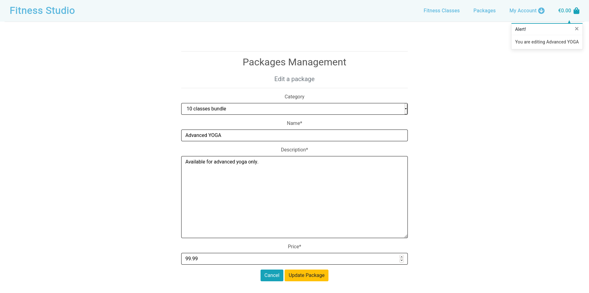
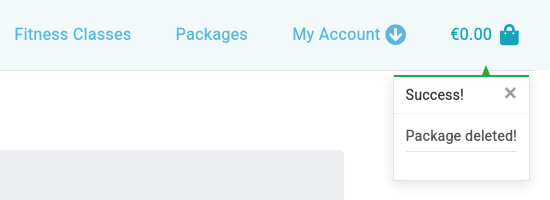
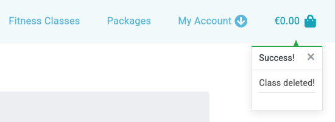

# Table of contents
- [Compatibility testing](#compatibility-testing)
- [Functionality testing](#functionality-testing)
- [User stories testing](#user-stories-testing)
- [Issues found during site development](#issues-found-during-site-development)
- [Code Validation](#code-validation)

## Compatibility testing

I used Mozilla web developer tools and Chrome developer tools throughout the project for testing and solving problems with responsiveness and style issues.

Site was tested across multiple virtual mobile devices and browsers. I checked all supported devices in both Mozilla web developer tolls and Chrome developer tools.

All tests Passed for devices from 360px on Chrome developer tools and Mozilla web developer tolls.

I tested on hardware devices such as: Lenovo ideapad with Ubuntu and Windows OS's as a virtual machines,
Lenovo smartphone with Android 7, LG smartphone with Android 8, Google pixel 3 with Android 11. No issues found.

## Functionality testing

### Navigation
| Functionality | Expected Outcome | Actual Outcome | Pass/Fail |
| :-------------: |:----------------:| :--------------: | :---------: |
| Clicking on Logo button | Opens landing page | As Expected | Pass |
| Clicking on Fitness Classes link | Opens Fitness Classes page | As expected | Pass |
| Clicking on Packages link | Opens Packages page | As expected | Pass |
| Clicking on Register link | Opens Register page | As expected | Pass |
| Clicking on Login link | Login user | As expected | Pass |
| Clicking on My Profile link | Opens My Profile page | As expected | Pass |
| Clicking on Logout link | Opens Sign Out page | As expected | Pass |
| Clicking on Shopping Bag link | Opens Shopping Bag page | As expected | Pass |

### Home page
| Functionality | Expected Outcome | Actual Outcome | Pass/Fail |
| :-------------: |:----------------:| :--------------: | :---------: |
| Clicking on Buy Package link | Opens Packages page | As expected | Pass |
| Clicking on Class description link | Opens Fitness Classes page | As expected | Pass |
| Clicking on Contact us link | Opens Contact us page | As expected | Pass |

### Fitness Classes page
| Functionality | Expected Outcome | Actual Outcome | Pass/Fail |
| :-------------: |:----------------:| :--------------: | :---------: |
| Clicking on `Buy single class` button | Opens Single entry package page | As expected | Pass |
| If login as administrator Clicking on `Edit` button | Opens Classes Management for selected class | As expected | Pass |
| If login as administrator Clicking on `Delete` button | Deletes selected class | As expected | Pass |

### Classes Management - add - administrator only
| Functionality | Expected Outcome | Actual Outcome | Pass/Fail |
| :-------------: |:----------------:| :--------------: | :---------: |
| Clicking on `Cancel` button | Opens Classes page | As expected | Pass |
| Clicking on `Add Classes` button | Adds selected class | As expected | Pass |

### Classes Management - edit - administrator only
| Functionality | Expected Outcome | Actual Outcome | Pass/Fail |
| :-------------: |:----------------:| :--------------: | :---------: |
| Clicking on `Cancel` button | Opens Classes page | As expected | Pass |
| Clicking on `Update Classes` button | Updates selected class | As expected | Pass |

### Packages page
| Functionality | Expected Outcome | Actual Outcome | Pass/Fail |
| :-------------: |:----------------:| :--------------: | :---------: |
| Clicking on `Buy this package` button | Opens selected package page | As expected | Pass |
| If login as administrator Clicking on `Edit` button | Opens Packages Management for selected package | As expected | Pass |
| If login as administrator Clicking on `Delete` button | Deletes selected package | As expected | Pass |

### Package details page
| Functionality | Expected Outcome | Actual Outcome | Pass/Fail |
| :-------------: |:----------------:| :--------------: | :---------: |
| Clicking on `Go to bag` button | Opens Shopping Bag page | As expected | Pass |
| Clicking on `Add to bag` button | Opens selected package page | As expected | Pass |
| Clicking on `Go back to add more` button |  Opens Packages page | As expected | Pass |

### Packages Management - add - administrator only
| Functionality | Expected Outcome | Actual Outcome | Pass/Fail |
| :-------------: |:----------------:| :--------------: | :---------: |
| Clicking on `Cancel` button | Opens Packages page | As expected | Pass |
| Clicking on `Update package` button | Adds selected package | As expected | Pass |

### Packages Management - edit - administrator only
| Functionality | Expected Outcome | Actual Outcome | Pass/Fail |
| :-------------: |:----------------:| :--------------: | :---------: |
| Clicking on `Cancel` button | Opens Packages page | As expected | Pass |
| Clicking on `Update package` button | Updates selected package | As expected | Pass |

### My Profile page
| Functionality | Expected Outcome | Actual Outcome | Pass/Fail |
| :-------------: |:----------------:| :--------------: | :---------: |
| Clicking on `Updatde information` button | Updates user profile | As expected | Pass |
| Clicking on order number link | Opens order history page for selected order | As expected | Pass |

### Thank you - order confirmation history page when user is login 
| Functionality | Expected Outcome | Actual Outcome | Pass/Fail |
| :-------------: |:----------------:| :--------------: | :---------: |
| Clicking on `Back to profile` button | Opens My Profile page | As expected | Pass |
| Clicking on `Cotact us to book a space` button | Opens Contact us page | As expected | Pass |

### Shopping Bag page
| Functionality | Expected Outcome | Actual Outcome | Pass/Fail |
| :-------------: |:----------------:| :--------------: | :---------: |
| Clicking on + or - button | increase or decrease quantity | As expected | Pass |
| Clicking on Updatde link | Updates package quantity, subtotal and total price | As expected | Pass |
| Clicking on Remove link | Removes selected package | As expected | Pass |
| Clicking on `Go back to add more` button | Opens Packages page | As expected | Pass |
| Clicking on `Secure checkout` button | Opens Checkout page | As expected | Pass |

### Checkout page
| Functionality | Expected Outcome | Actual Outcome | Pass/Fail |
| :-------------: |:----------------:| :--------------: | :---------: |
| Clicking on `Go back to the bag` button | Opens Shopping Bag page | As expected | Pass |
| Clicking on `Complete order` button | Opens Thank you - order confirmation page | As expected | Pass |

### Thank you - order confirmation page
| Functionality | Expected Outcome | Actual Outcome | Pass/Fail |
| :-------------: |:----------------:| :--------------: | :---------: |
| Clicking on `Go back to home page` button | Opens Home page | As expected | Pass |
| Clicking on `Cotact us to book a space` button | Opens Contact us page | As expected | Pass |

### Contact us page
| Functionality | Expected Outcome | Actual Outcome | Pass/Fail |
| :-------------: |:----------------:| :--------------: | :---------: |
| Clicking on `Send a message` button | Opens Email sent successfully! popup window | As expected | Pass |

[Back to Table of contents](#table-of-contents)
___

## User stories testing

**ID** | **As a/an** | **I want to be able to...** | **So that I can**
--- | --- | --- | ---
1 | Site User | Register to the site | Log in to my account 

From navigation menu under my account button user can register to the site.

**ID** | **As a/an** | **I want to be able to...** | **So that I can**
--- | --- | --- | ---
2 | Site User | Log In and Log Out | View my profile

From navigation menu under my account button user can login to the site.

To logout from navigation menu under my account button user can click logout.

Sign Out page will appear to confirm an operation.

A "Success!" message will appear in top right corner.

**ID** | **As a/an** | **I want to be able to...** | **So that I can**
--- | --- | --- | ---
3 | Site User | Receive email confirmation | Confirm successful registration

After registration user will see: "Verify Your E-mail Address" message and receive email to it's email account.

Then on email message there will be a link to confirm:
    
    You're receiving this e-mail because user test2 has given your e-mail address to register an account on Fitness Studio.
    To confirm this is correct, go to https://fitnesssstudio.herokuapp.com/accounts/confirm-email/MTc:1lk3sk:7p0nJ6eX2Pr0Pt_l2BoIfxOpwQFz_zalrutx5cnN6xs/

New window will appear to confirm.

User can confirm it's account by Confirm button and will be redirect to login page.
A "Success!" message will appear in top right corner.

**ID** | **As a/an** | **I want to be able to...** | **So that I can**
--- | --- | --- | ---
4 | Site User | Have a user profile | View my purchases, and be able to check my order history

From navigation menu under my account button logged user can see My Profile.

On My Profile page user can see Profile Information and Order History.

**ID** | **As a/an** | **I want to be able to...** | **So that I can**
--- | --- | --- | ---
5 | Potential customer | View a list of packages | Select to purchase

To view a list of packages user needs to go to Packages from the navigation menu.

On Packages site user will be able to choose a package.

**ID** | **As a/an** | **I want to be able to...** | **So that I can**
--- | --- | --- | ---
6 | Potential customer | View packages details | See price and description

From site Packages customer can choose a package by clicking Buy this package.
New site will show details of selected package.

**ID** | **As a/an** | **I want to be able to...** | **So that I can**
--- | --- | --- | ---
7 | Potential customer | Contact fitness studio | Book a place

On the bottom of the landing page there is contact us card. Contact us link opens Contact page.

Here user can fill the form to contact fitness studio.

**ID** | **As a/an** | **I want to be able to...** | **So that I can**
--- | --- | --- | ---
8 | Customer | View items in my bag | Check the cost to review

To view items in the bag user need to choose a basket icon in top right corner.

From this site user can see basket, cost and adjust if necessary.

**ID** | **As a/an** | **I want to be able to...** | **So that I can**
--- | --- | --- | ---
9 | Customer | Enter payment information and see that process is secure | Checkout without issues

From Shopping Bag page customer can click Secure Checkout and will see checkout details.
From here needs to provide personal details and card details. Last step to complete transaction is by clicking Complete order.

After few seconds customer will see confirmation page. 

**ID** | **As a/an** | **I want to be able to...** | **So that I can**
--- | --- | --- | ---
10 | Customer | Contact fitness studio after payment | Booked a place

On confirmation page there are two buttons. Go back to home page and Contact a studio to book a space.
To book a place customer needs to click second button.

**ID** | **As a/an** | **I want to be able to...** | **So that I can**
--- | --- | --- | ---
11 | Administrator | Add new classes or packages | To make them visible to customer

From navigation menu administrator can choose add class or add package.

On classes management page administrator can add new class. Image field is not mandatory.
New page shows details for new class.

On packages management page administrator can add new package.

New page shows details for new package.

**ID** | **As a/an** | **I want to be able to...** | **So that I can**
--- | --- | --- | ---
12 | Administrator | Edit and update classes or packages | To change a price, description or time

Administrator can edit class or package by clicking Edit button on fitness classes or packages page.
After that it is possible to change and update class or package.

**ID** | **As a/an** | **I want to be able to...** | **So that I can**
--- | --- | --- | ---
13 | Administrator | Delete classes or packages | To remove from a site

Class or package can be removed by clicking Delete button.

 

A confirmation message will appear in top right corner after deletion.

 

[Back to Table of contents](#table-of-contents)
___
## Issues found during site development

A small bug was found during functionality testing.

When I add or update a package, toast message card shows $ symbol instead of € symbol.

I changed this in toast_success.html file in line 34

    €{{ total|floatformat:2 }}

___
Bugs not solved:

I found few issues with cards on landing page on Mozilla browser only. At Chrome browser there was no issues.

Cards are not vertically aligned on all resolutions.

One example on screen width 1560px:

[Back to Table of contents](#table-of-contents)
___
## Code Validation

### Nu Html Checker

One issue related to ID in `a` tag. This appear because there are same id's for mobile and desktop navbars.

### W3C CSS Validator

### Jshint to test JavaScript

### PEP8 online

#### Result: Pass

[Back to Table of contents](#table-of-contents)

#### Back to [README.md](https://github.com/marcin-kli/MS4)