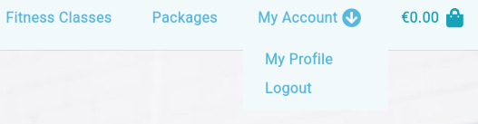

# Table of contents
- [User stories testing](#user-stories-testing)
- [Issues found during site development](#issues-found-during-site-development)
- [Code Validation](#code-validation)

I used Mozilla web developer tools and Chrome developer tools throughout the project for testing and solving problems with responsiveness and style issues.

Site was tested across multiple virtual mobile devices and browsers. I checked all supported devices in both Mozilla web developer tolls and Chrome developer tools.

All tests Passed for devices from 360px on Chrome developer tools and Mozilla web developer tolls.

## User stories testing

**ID** | **As a/an** | **I want to be able to...** | **So that I can**
--- | --- | --- | ---
1 | Site User | Register to the site | Log in to my account 

From navigation menu under my account button user can register to the site.

**ID** | **As a/an** | **I want to be able to...** | **So that I can**
--- | --- | --- | ---
2 | Site User | Log In and Log Out | View my profile

From navigation menu under my account button user can login to the site.

To logout from navigation menu under my account button user can click logout.

Sign Out page will appear to confirm an operation.

A "Success!" message will appear in top right corner.

**ID** | **As a/an** | **I want to be able to...** | **So that I can**
--- | --- | --- | ---
3 | Site User | Receive email confirmation | Confirm successful registration

After registration user will see: "Verify Your E-mail Address" message and receive email to it's email account.

Then on email message there will be a link to confirm:
    
    You're receiving this e-mail because user test2 has given your e-mail address to register an account on Fitness Studio.
    To confirm this is correct, go to https://fitnesssstudio.herokuapp.com/accounts/confirm-email/MTc:1lk3sk:7p0nJ6eX2Pr0Pt_l2BoIfxOpwQFz_zalrutx5cnN6xs/

New window will appear to confirm

User can confirm it's account by Confirm button and will be redirect to login page.
A "Success!" message will appear in top right corner.

**ID** | **As a/an** | **I want to be able to...** | **So that I can**
--- | --- | --- | ---
4 | Site User | Have a user profile | View my purchases, and be able to check my order history

From navigation menu under my account button logged user can see My Profile.

On My Profile page user can see Profile Information and Order History.

[Back to Table of contents](#table-of-contents)
___
## Issues found during site development

I found few issues with cards on landing page on Mozilla browser only. At Chrome browser there was no issues.

[Back to Table of contents](#table-of-contents)
___
## Code Validation

Nu Html Checker

One issue related to ID in `a` tag. This appear because there are same id's for mobile and desktop navbars.

No issued on W3C CSS Validator

[Back to Table of contents](#table-of-contents)